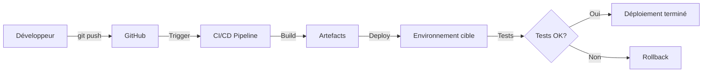

# 📘 Dossier Technique de Déploiement
## FollowUp Front - Application Angular

**Version** : 1.0.0  
**Date** : 04/02/2026  
**Auteur** : [Votre nom]  
**Statut** : ✅ Validé

---

## 📋 Table des matières

1. [Introduction](#introduction)
2. [Architecture technique](#architecture-technique)
3. [Environnements](#environnements)
4. [Procédure de build](#procédure-de-build)
5. [Procédure de déploiement](#procédure-de-déploiement)
6. [Tests](#tests)
7. [Monitoring et supervision](#monitoring-et-supervision)
8. [Sécurité](#sécurité)
9. [Procédure de rollback](#procédure-de-rollback)
10. [Contacts et support](#contacts-et-support)

---

## 1. Introduction

### 1.1 Contexte

FollowUp Front est une application web Angular 20 permettant aux utilisateurs de suivre leurs candidatures professionnelles. Cette application nécessite un déploiement sécurisé et fiable en production.

### 1.2 Objectif du document

Ce document décrit la procédure complète de déploiement de l'application, conformément aux bonnes pratiques DevOps et aux exigences du REAC CDA (Concepteur Développeur d'Applications).

### 1.3 Public visé

- Développeurs
- DevOps / Administrateurs système
- Chef de projet
- Équipe de production

---

## 2. Architecture technique

### 2.1 Stack technique

| Composant        | Technologie | Version |
|------------------|-------------|---------|
| Framework        | Angular     | 20.3.0  |
| Langage          | TypeScript  | 5.9.2   |
| Runtime          | Node.js     | 20.x    |
| Package Manager  | npm         | 9.x     |
| Server (SSR)     | Express     | 5.1.0   |

### 2.2 Architecture applicative
```
┌──────────────────────────────────────────┐
│         Utilisateur (Navigateur)         │
└────────────────┬─────────────────────────┘
                 │ HTTPS
                 ↓
┌──────────────────────────────────────────┐
│      Serveur Web (Nginx/Apache)          │
│      - Reverse Proxy                     │
│      - SSL/TLS Termination               │
│      - Compression Gzip                  │
└────────────────┬─────────────────────────┘
                 │
                 ↓
┌──────────────────────────────────────────┐
│      Application Angular (SPA)           │
│      - Routing client-side               │
│      - Service Worker (PWA)              │
└────────────────┬─────────────────────────┘
                 │ REST API
                 ↓
┌──────────────────────────────────────────┐
│         API Backend (Node.js)            │
│         - Authentification JWT           │
│         - Business Logic                 │
└────────────────┬─────────────────────────┘
                 │
                 ↓
┌──────────────────────────────────────────┐
│      Base de données (PostgreSQL)        │
└──────────────────────────────────────────┘
```

### 2.3 Dépendances externes

- **API Backend** : `https://api.followup.com`
- **Service OAuth** : Google OAuth 2.0
- **CDN** : Aucun (assets auto-hébergés)

---

## 3. Environnements

### 3.1 Tableau récapitulatif

| Environnement | URL                    | Backend API                 | Base de données |
|---------------|------------------------|-----------------------------|-----------------|
| DEV           | localhost:4200         | localhost:8080              | SQLite locale   |
| SIT           | sit.followup.com       | api-sit.followup.com        | PostgreSQL SIT  |
| UAT           | uat.followup.com       | api-uat.followup.com        | PostgreSQL UAT  |
| PROD          | followup.com           | api.followup.com            | PostgreSQL PROD |

### 3.2 Configuration des environnements

Voir fichier détaillé : [`deployment/environments.md`](../deployment/environments.md)

---

## 4. Procédure de build

### 4.1 Prérequis système
```bash
# Vérifier Node.js
node -v  # Doit être >= 20.0.0

# Vérifier npm
npm -v   # Doit être >= 9.0.0
```

### 4.2 Installation des dépendances
```bash
# Installation clean (recommandé pour CI/CD)
npm ci

# OU installation classique
npm install
```

### 4.3 Build de production
```bash
# Build optimisé pour la production
npm run build -- --configuration production

# Build pour un environnement spécifique
npm run build -- --configuration sit
npm run build -- --configuration uat
npm run build -- --configuration prod
```

### 4.4 Artefacts générés

Les fichiers de build se trouvent dans : `dist/followup-front/browser/`

Structure :
```
dist/followup-front/browser/
├── index.html                    # Page d'entrée
├── main-[hash].js                # Bundle principal (lazy-loaded)
├── polyfills-[hash].js           # Polyfills ES6+
├── styles-[hash].css             # Styles globaux
├── assets/                       # Assets statiques
│   ├── icons/                    # Icônes de l'app
│   └── navbar/                   # Images de navigation
├── manifest.webmanifest          # PWA manifest
├── ngsw.json                     # Service Worker config
└── ngsw-worker.js                # Service Worker
```

### 4.5 Optimisations du build

- **Tree shaking** : Code non utilisé supprimé
- **Minification** : JS et CSS minifiés
- **Uglification** : Noms de variables raccourcis
- **Source maps** : Désactivées en production
- **Lazy loading** : Routes chargées à la demande
- **PWA** : Service Worker pour cache offline

---

## 5. Procédure de déploiement

### 5.1 Vue d'ensemble


### 5.2 Déploiement automatique (CI/CD)

Le déploiement utilise GitHub Actions :

**Fichier** : `.github/workflows/cd.yml`

**Déclenchement** :
- Manuel via interface GitHub Actions
- Choix de l'environnement cible (SIT/UAT/PROD)

**Étapes** :
1. Checkout du code
2. Installation des dépendances
3. Build pour l'environnement cible
4. Upload des artefacts
5. Déploiement (simulé)
6. Tests post-déploiement

### 5.3 Déploiement manuel (script)

**Fichier** : `deployment/deploy.sh`
```bash
# Déploiement vers SIT
./deployment/deploy.sh sit

# Déploiement vers UAT
./deployment/deploy.sh uat

# Déploiement vers PRODUCTION
./deployment/deploy.sh prod
```

Le script effectue :
1. Vérifications pré-déploiement
2. Installation des dépendances
3. Build de production
4. Backup de l'environnement
5. Déploiement (simulé)
6. Tests post-déploiement
7. Notifications

---

## 6. Tests

### 6.1 Tests pré-déploiement

#### Tests unitaires
```bash
npm run test:ci
```

#### Tests d'intégration
```bash
# À implémenter avec Cypress ou Playwright
npm run test:e2e
```

#### Analyse de code
```bash
npm run lint
npm audit
```

### 6.2 Tests post-déploiement

**Tests de fumée (Smoke Tests)** :
- [ ] Site accessible
- [ ] Page d'accueil se charge
- [ ] Connexion utilisateur
- [ ] Navigation entre pages
- [ ] Appels API fonctionnels

**Tests de performance** :
- Lighthouse score > 90
- Temps de chargement < 3 secondes
- First Contentful Paint < 1.5s

---

## 7. Monitoring et supervision

### 7.1 Métriques à surveiller

| Métrique                  | Seuil critique | Action               |
|---------------------------|----------------|----------------------|
| Disponibilité (uptime)    | < 99%          | Alerte immédiate     |
| Temps de réponse          | > 3s           | Investigation        |
| Taux d'erreur 5xx         | > 1%           | Rollback si > 5%     |
| Utilisation CPU           | > 80%          | Scaling horizontal   |
| Utilisation mémoire       | > 85%          | Investigation        |

### 7.2 Outils de monitoring

- **Uptime** : UptimeRobot, Pingdom
- **APM** : New Relic, Datadog
- **Logs** : CloudWatch, Loggly
- **Alertes** : PagerDuty, Slack notifications

---

## 8. Sécurité

### 8.1 Mesures de sécurité implémentées

- ✅ HTTPS obligatoire (TLS 1.2+)
- ✅ Headers de sécurité configurés
- ✅ Content Security Policy (CSP)
- ✅ Protection CSRF
- ✅ Protection XSS (sanitization Angular)
- ✅ Authentification JWT
- ✅ RGPD : conformité complète
- ✅ RGAA : accessibilité

### 8.2 Vulnérabilités connues
```bash
# Scan de sécurité
npm audit

# Mise à jour des dépendances vulnérables
npm audit fix
```

---

## 9. Procédure de rollback

### 9.1 Critères de déclenchement

- Taux d'erreur > 5%
- Fonctionnalité critique indisponible
- Dégradation majeure des performances
- Bug bloquant signalé par les utilisateurs

### 9.2 Procédure de retour arrière

#### Méthode 1 : Restauration depuis backup
```bash
# Restaurer le backup précédent
ssh user@server "cp -r /var/www/followup-front-backup/* /var/www/followup-front/"
ssh user@server "sudo systemctl reload nginx"
```

#### Méthode 2 : Redéploiement d'une version précédente
```bash
# Utiliser un artefact précédent depuis GitHub Actions
# ou redéployer une version taguée sur Git
git checkout v1.0.0
npm ci
npm run build -- --configuration production
./deployment/deploy.sh prod
```

### 9.3 Temps de rollback estimé

- **SIT/UAT** : 5 minutes
- **PROD** : 10 minutes (avec validations)

---

## 10. Contacts et support

### 10.1 Équipe projet

| Rôle                      | Nom                | Email                  | Téléphone       |
|---------------------------|--------------------|------------------------|-----------------|
| Chef de projet            | [Nom]              | [email]                | [téléphone]     |
| Développeur Lead          | [Votre nom]        | [email]                | [téléphone]     |
| DevOps                    | [Nom]              | [email]                | [téléphone]     |
| Administrateur système    | [Nom]              | [email]                | [téléphone]     |

### 10.2 Escalade en cas de problème

1. **Niveau 1** : Développeur (résolution < 30 min)
2. **Niveau 2** : Chef de projet + DevOps (résolution < 2h)
3. **Niveau 3** : Directeur technique (décision de rollback)

---

## 📎 Annexes

### A. Références

- [Documentation Angular](https://angular.io/)
- [Guide ANSSI sécurité web](https://www.ssi.gouv.fr/)
- [RGPD - Guide CNIL](https://www.cnil.fr/)
- [RGAA 4.1](https://www.numerique.gouv.fr/publications/rgaa-accessibilite/)

### B. Historique des versions

| Version | Date       | Auteur      | Modifications                    |
|---------|------------|-------------|----------------------------------|
| 1.0.0   | 04/02/2026 | [Votre nom] | Création du document             |

### C. Glossaire

- **CI/CD** : Continuous Integration / Continuous Deployment
- **SIT** : System Integration Testing
- **UAT** : User Acceptance Testing
- **PWA** : Progressive Web App
- **SSR** : Server-Side Rendering
- **JWT** : JSON Web Token

---

**Fin du document**